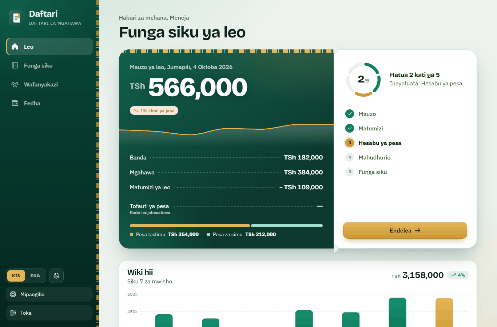
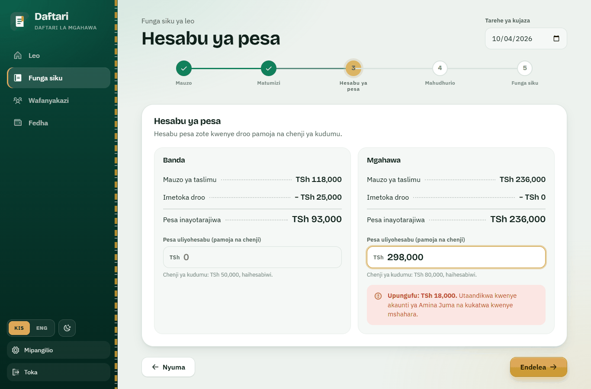
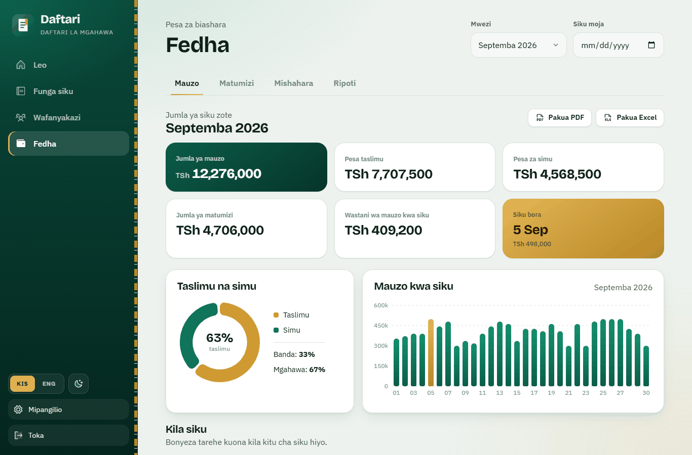
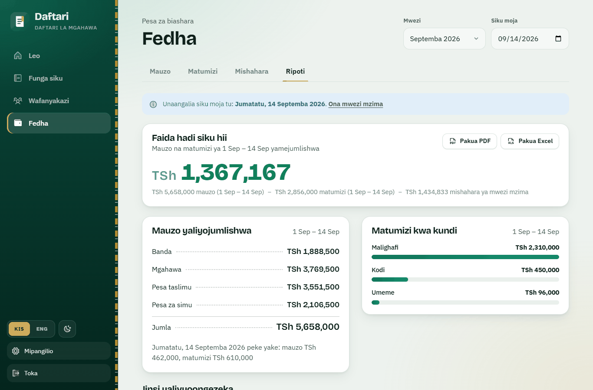
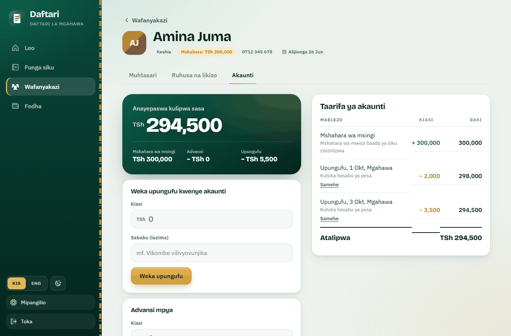
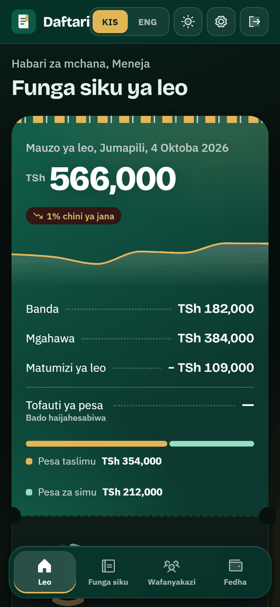

# Daftari

**Daftari** ("notebook" in Swahili) is a bookkeeping web app for a small Tanzanian food business with two sections: a chips stall (**banda**) and a restaurant (**mgahawa**). The manager uses it each evening to record sales and expenses, count the cash in each till, and mark attendance. From those records it works out cash shortages, salaries and profit.

The app is for the manager only: there is one login, and workers do not sign in. Every screen is available in Swahili and English, and it works on a phone.



---

## Contents

- [What it does](#what-it-does)
- [Screenshots](#screenshots)
- [How the money is worked out](#how-the-money-is-worked-out)
- [Rules the server enforces](#rules-the-server-enforces)
- [Running it](#running-it)
- [Configuration](#configuration)
- [Project layout](#project-layout)
- [API overview](#api-overview)
- [Going to production](#going-to-production)

---

## What it does

### Leo (Today)
The home screen shows:
- **Today's sales**, split between banda and mgahawa, and between cash and mobile money.
- **Today's expenses** and the **cash difference** once the till has been counted.
- **Progress through the close-day steps**, with a button to continue.
- **The last 7 days** of sales.
- **Today's workers** and whether each one is present.
- **"Waiting for you"**: shortages written today, and salaries from earlier months that are still unpaid.

### Funga siku (Close the day)
A five-step wizard, done once per day:

1. **Mauzo (Sales):** cash and mobile money totals for each section, plus the cashier of the day.
2. **Matumizi (Expenses):** what was spent, from which source (till, mobile money or other), and for which section.
3. **Hesabu ya pesa (Cash count):** the manager counts each till. The app shows what *should* be there and the difference.
4. **Mahudhurio (Attendance):** each worker is marked present, late or absent. Days off and leave are filled in automatically.
5. **Funga siku (Close):** a summary. Closing locks the day, and any shortage goes straight onto the cashier's account.

A **"Tarehe ya kujaza" (day to fill)** field lets the manager fill and close earlier days that were missed. After an earlier day is closed, the wizard moves on to the next day.

### Wafanyakazi (Workers)
Each worker has:
- **Details:** role (cashier, cook, waiter, other), phone number, and pay, either monthly or daily.
- **Dates:** a weekly day off and a start date.
- **Leave:** *ruhusa* (permission) and *likizo* (holiday) periods. These show on an attendance calendar.
- **An account statement:** base pay, minus advances, minus shortages, giving the net pay.

From the worker's page the manager can write a manual shortage (a reason is required), give an advance, or waive a shortage. A worker can be removed and later restored; their history stays.

### Fedha (Money)
Pick a **month**, or pick a **single day** (*Siku moja*), and all four tabs follow that choice:

| Tab | Whole month | One day |
|---|---|---|
| **Mauzo** (Sales) | Totals, cash/mobile split, sales-by-day chart, and a table of every day with its sales, expenses and cash difference | That day's sales, expenses, cash difference, shortages, advances and attendance, with the month's totals below |
| **Matumizi** (Expenses) | Month total, totals by category, latest expenses | That day's expenses, plus a form to add one if the day is still open |
| **Mishahara** (Salaries) | The salary list: approve it, mark each line paid, and set how special days count | What each worker earned that day |
| **Ripoti** (Reports) | Profit for the month | Profit up to that day (see below) |

The month and one-day reports can be downloaded as **PDF** or **Excel**, in either language.

### Mipangilio (Settings)
- the fixed **change float** kept in each till
- **expense categories:** add, hide or show, or delete if never used
- **change password**

---

## Screenshots

All screenshots use the built-in demo data. The names in them are made up.

| Closing the day: cash count | The money page for a month |
|---|---|
|  |  |
| **One-day report: profit up to that day** | **A worker's account** |
|  |  |

<p align="center"></p>

---

## How the money is worked out

All money is calculated on the server in [`backend/core/services.py`](backend/core/services.py). The screens only display the results.

**Cash difference** is worked out for each section when the till is counted:

```
expected cash   = cash sales − expenses paid from that till
cash difference = cash counted − change float − expected cash
```

Mobile money is not part of this calculation because it never goes into the till. The result means:
- **Below zero:** a shortage (*upungufu*). When the day is closed it is written onto the cashier's account and taken from their pay, unless the manager waives it.
- **Above zero:** a surplus (*ziada*). Nobody is charged. It usually means a sale was not recorded, or an expense was not really paid from the till.

**Monthly salaries:**

```
base pay = monthly rate − (monthly rate ÷ 30 × unpaid days)
```

Unpaid days are:
- days marked **absent**;
- days before the worker's start date, or after they were removed;
- days off, permission or holiday, if the rules on the Salaries tab say these are cut.

Days that have not happened yet are never cut.

**Daily pay:**

```
base pay = daily rate × days worked
```

Days worked are those marked present or late. Days off, permission and holiday are added if the rules say they are paid.

**Net pay:**

```
net pay = base pay − advances − shortages that were not waived   (never below 0)
```

**Profit for a month:**

```
profit = sales − expenses − (net salaries + advances)
```

During the month, profit looks low, because monthly salaries count in full from the first day.

**Profit up to a chosen day** (the Ripoti tab with one day selected):

```
profit = sales from the 1st to that day − expenses from the 1st to that day − the whole month's salaries
```

A table shows how sales and expenses add up day by day. On the last day of the month this equals the month's profit.

**One day's pay** (the Mishahara tab with one day selected) is the monthly rate ÷ 30 for monthly workers, unless that day is cut. For daily workers it is their rate if they worked that day.

---

## Rules the server enforces

- **Closed days are locked.** A mistake is corrected by adding a new entry, not by editing the day.
- **Closing a day needs:**
  - every active worker marked for attendance;
  - a cashier chosen for any section that has a shortage.
- **Closing writes the shortage straight onto the cashier's account.**
- **Shortages and advances can be changed only until the month's salary list is approved:** shortages can be waived or re-applied, and advances added. Approval also locks the special-day rules.
- **Approved salary lists are snapshotted**, so later changes cannot alter them.
- **Unpaid salaries carry forward.** Pay from an approved month stays on the worker's account until it is marked paid.
- **Manual shortages need a reason.** An expense category that is already in use cannot be deleted; hide it instead.
- **Important actions are recorded in an `AuditLog`:**
  - closing a day;
  - creating, waiving or re-applying a shortage;
  - giving an advance;
  - deleting an expense;
  - approving salaries and marking them paid;
  - adding, removing or restoring a worker;
  - changing settings, deleting a category, or changing the password.

---

## Running it

You need **Python 3.10+** and **Node.js 20.19+** (or 22.12+). **Docker** is optional; it is only used to run PostgreSQL.

### Windows: one click

Double-click **`start.bat`**. The first run installs everything. If Docker is missing, it uses SQLite instead of PostgreSQL. It then starts the backend and frontend in two windows and opens http://localhost:5173. Close those two windows to stop the app.

### By hand

```bash
# 1. database (skip this and set USE_SQLITE=1 in backend/.env to use SQLite)
docker compose up -d            # PostgreSQL 16, user/password/db: daftari

# 2. backend
cd backend
python -m venv .venv
.venv/Scripts/activate          # Linux/Mac: source .venv/bin/activate
pip install -r requirements.txt
cp .env.example .env
python manage.py migrate
python manage.py seed_demo --demo   # login manager / daftari123 + three months of sample data
python manage.py runserver          # http://127.0.0.1:8000

# 3. frontend (in a second terminal)
cd frontend
npm install
npm run dev                         # http://localhost:5173
```

- **Empty start:** leave out `--demo` to start with no data. `seed_demo` still creates the login, the expense categories and the settings. It is safe to run more than once.
- **Change the password:** `python manage.py changepassword manager`.
- **Tests:** `cd backend` and run `python manage.py test core`, with `USE_SQLITE=1` set in the environment or in `.env`.

---

## Configuration

The backend reads `backend/.env`. The file [`backend/.env.example`](backend/.env.example) lists every setting.

| Variable | Default | Meaning |
|---|---|---|
| `DEBUG` | `1` | Set to `0` in production |
| `SECRET_KEY` | dev-only key | **Required** when `DEBUG=0` |
| `ALLOWED_HOSTS` | `localhost,127.0.0.1` | Comma-separated host names |
| `CORS_ORIGINS` | `http://localhost:5173,…` | Where the frontend is served from |
| `USE_SQLITE` | unset | `1` uses `backend/db.sqlite3` instead of PostgreSQL |
| `POSTGRES_DB` / `_USER` / `_PASSWORD` / `_HOST` / `_PORT` | `daftari` … `5432` | PostgreSQL connection |

The frontend sends its API calls to `/api`. During development, Vite forwards those calls to `http://127.0.0.1:8000`. To use a different API address, set `VITE_API_URL` when building the frontend.

The time zone is `Africa/Dar_es_Salaam`. Login tokens (JWT) last 2 hours and refresh for up to 30 days.

---

## Project layout

```
backend/                  Django 5 + Django REST Framework
  config/                 settings, URLs, WSGI
  core/
    models.py             Worker, Day, DaySection, Attendance, Expense, Advance, Shortage,
                          LeaveRecord, SalaryRun, SalaryLine, Settings, AuditLog
    services.py           every business rule and money calculation
    views.py, urls.py     thin REST endpoints
    exports.py            PDF (reportlab) and Excel (openpyxl) reports
    management/commands/seed_demo.py   login, categories, settings and optional demo data
    tests.py              rule tests (cash difference, closing, salaries, reports)
frontend/                 React 19 + Vite
  src/pages/              Leo, Close (Funga siku), Workers, Money (Fedha), Settings, Login
  src/components/         shared UI, charts, forms
  src/vocab.js, i18n.jsx  every label as a [Swahili, English] pair
legacy-prototype/         the first in-memory design prototype, kept for reference
docs/screenshots/         images used in this README
start.bat                 Windows starter
docker-compose.yml        PostgreSQL 16 for development
```

**Frontend libraries:** TanStack Query, React Router, Motion, Recharts, Radix Dialog, Phosphor icons and Sonner.

---

## API overview

Every endpoint is under `/api/` and needs a `Bearer` token, except login.

| Area | Endpoints |
|---|---|
| Auth | `POST auth/login/`, `POST auth/refresh/`, `GET auth/me/`, `POST auth/change-password/` |
| Settings | `GET/PATCH meta/`, `categories/` |
| Workers | `workers/`, `workers/<id>/`, `…/remove/`, `…/restore/`, `…/leaves/`, `…/account/?month=`, `…/shortages/` |
| A day | `GET days/<date>/`, `PUT …/sales/`, `PUT …/cash-count/`, `PUT …/attendance/`, `POST …/close/`, `GET …/pay/` |
| Money | `expenses/?month=`, `advances/`, `shortages/<id>/` |
| Salaries | `GET salary/<yyyy-mm>/`, `POST …/approve/`, `POST salary-lines/<id>/paid/` |
| Reports | `GET reports/month/<yyyy-mm>/` and `GET reports/day/<date>/`, with `?file=pdf\|xlsx&lang=sw\|en` to download |

---

## Going to production

The repository does not include a deployment setup yet. These are the parts to set up:

1. In `backend/.env`, set `DEBUG=0`, a long random `SECRET_KEY`, your domain in `ALLOWED_HOSTS`, and the frontend's address in `CORS_ORIGINS`. Use PostgreSQL rather than SQLite.
2. Run `python manage.py migrate` and `python manage.py collectstatic`. Then serve the backend with `gunicorn config.wsgi`. WhiteNoise serves the admin's static files.
3. Run `npm run build` in `frontend/`. Set `VITE_API_URL` first if the API runs on another address. Serve the resulting `dist/` folder from any static host.
4. Change the manager password from the default.
